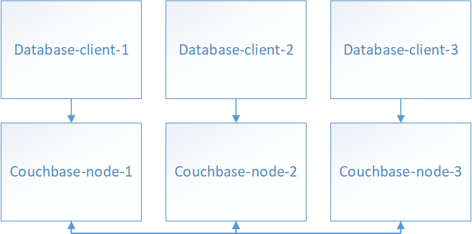

# Architecture / Used technologies



Our app is database-client on this scheme. Each node talks to corresponding couchbase node 
(Which should be located in the same data-center to decrease latency). Couchbase nodes are joined into cluster and
actually performs all data replication under the hood. 
Couchbase was chosen because it implements master-master topology, deals with failed nodes and can be scaled. 

Couchbase cluster needs to be configured manually through web ui. (See link below)

Application is written on Spring Boot 2.0 framework with Reactive Web support and uses Reactive couchbase driver - this
allows to work under bigger pressure.

# How to launch

1. Start couchbase and rabbitmq

```cmd
docker-compose up
```

2. Configure couchbase

https://developer.couchbase.com/documentation/server/current/install/init-setup.html

* Go to http://localhost:8091
* Start cluster
* Create bucket: "test" (Buckets -> Add Bucket)
* Create user with admin rights and password "couchbase" (Security -> Users -> Add user)

3. Start application

Open SharedDatabaseApplication.java in IDE and launch as java application

or 

```
mvnw spring-boot:run
```

(Unfortunately I didn't have enough time to set up couchbase auto configuration, this should be done manually, and
so Application should be launched separately.)

# Endpoints

* GET /data/{key} - Get latest version for the given key
* GET /data/history/{key} - Get full history for the given key
* GET /data/dump - Get all data stored in the database
* POST /data/{key} - Saving new value associated with key
* DELETE /data/{key} - Deleting value for the given key (Actually it saves null value so history is preserved)

Instead of addListener endpoint I implemented this with RabbitMq exchange. All clients interested in updates can simply
subscribe to the queue: localhost:5672, exchange name: test-exchange

Examples of queries:

```cmd
curl -X GET \
  http://localhost:8080/data/car \
  
curl -X POST \
  http://localhost:8080/data/car \
  -H 'Content-Type: application/json' \
  -d '{
	"author": "AuthorOfChange",
	"value": "Mazda"
}'  

curl -X GET \
  http://localhost:8080/data/history/car \
  
curl -X GET \
  'http://localhost:8080/data/dump?fileName=allData.txt' \
    
curl -X DELETE \
  'http://localhost:8080/data/car?author=AuthorOfRemove' \    
```